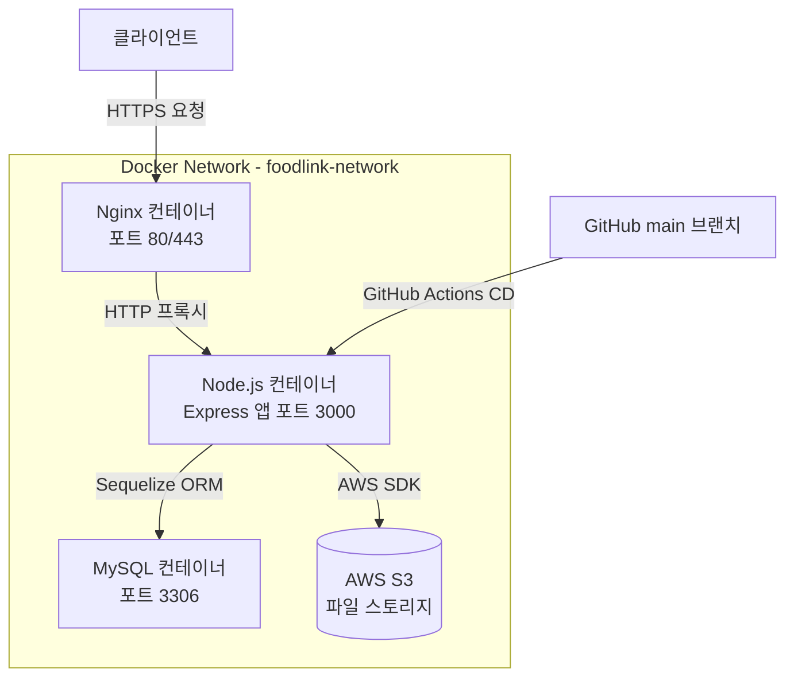

# FoodLink — 백엔드 서버

> GDGoC 팀 프로젝트 **FoodLink**의 백엔드 API 서버입니다.  
> Node.js + Express 기반으로 구축되었으며, MySQL 데이터베이스와 AWS S3 연동, JWT 인증, Swagger 문서화, Docker 컨테이너 배포까지 갖춘 RESTful API 서버입니다.

---

## 프로젝트 소개

FoodLink는 GDGoC(Google Developer Groups on Campus) 팀 프로젝트로 개발된 서비스입니다. 본 저장소(`BE`)는 그 백엔드 서버 구현체입니다.

서버는 Node.js와 Express(v5)를 기반으로 하며, Sequelize ORM을 통해 MySQL 데이터베이스와 연동합니다. 사용자 인증은 JWT와 bcrypt를 활용하며, 파일 업로드는 multer와 AWS S3를 통해 처리합니다. Swagger를 통한 API 문서화가 포함되어 있어 프론트엔드 팀과의 협업을 체계적으로 지원합니다.

배포 환경은 Docker Compose로 Node.js 애플리케이션, MySQL, Nginx를 하나의 네트워크로 묶어 운영하며, GitHub Actions를 통한 CD(지속적 배포) 파이프라인이 구성되어 있습니다. `api.surunserver.store` 도메인에 HTTPS(Let's Encrypt)로 서비스되는 것이 설정 파일에서 확인됩니다.

---

## 문제 정의

FoodLink 서비스가 필요로 하는 데이터 처리와 비즈니스 로직을 클라이언트로부터 분리하여 안정적으로 제공하는 것이 이 백엔드 서버의 핵심 목표입니다. 구체적으로는 다음 문제를 해결합니다.

- 사용자 인증 및 권한 관리를 안전하게 처리하는 API 계층이 필요했습니다.
- 이미지나 파일 업로드를 서버 디스크가 아닌 클라우드(AWS S3)에 위임하여 확장성을 확보해야 했습니다.
- 팀 협업을 위해 API 명세를 자동으로 문서화하는 수단이 필요했습니다.
- 로컬 개발 환경과 운영 배포 환경을 일관성 있게 유지하고, 코드 변경 시 자동으로 배포되는 파이프라인이 필요했습니다.

---

## 주요 기능

- **사용자 인증**: JWT 기반 토큰 발급 및 검증, bcrypt를 이용한 비밀번호 해싱 처리 (`package.json`의 `jsonwebtoken`, `bcrypt` 의존성 기준)

- **파일 업로드 (AWS S3 연동)**: multer와 multer-s3를 사용한 파일 수신 및 AWS S3 업로드 처리 (`@aws-sdk/client-s3`, `multer-s3` 의존성 기준)

- **데이터베이스 연동**: Sequelize ORM을 통한 MySQL 데이터 모델 정의 및 CRUD 처리 (`mysql2`, `sequelize` 의존성 기준)

- **API 문서화**: swagger-jsdoc + swagger-ui-express를 통한 API 스펙 자동 생성 및 웹 UI 제공 (`swagger-jsdoc`, `swagger-ui-express` 의존성 기준)

- **HTTPS 지원 및 리버스 프록시**: Nginx를 통해 80/443 포트 처리 및 Let's Encrypt SSL 인증서 적용 (`docker-compose.yml`, `nginx/conf.d` 폴더 기준)

- **자동 배포 (CD)**: GitHub Actions `deploy.yml` 워크플로우를 통해 `main` 브랜치 머지 시 자동 배포 (Actions 탭 기준, 총 18회 배포 이력 확인)

---

## 기술 스택

| 분류 | 기술 |
|---|---|
| **언어** | JavaScript (Node.js 20) |
| **프레임워크** | Express v5 |
| **ORM** | Sequelize v6 |
| **데이터베이스** | MySQL 8.0 |
| **인증** | JWT (jsonwebtoken), bcrypt |
| **파일 업로드** | multer, multer-s3, AWS S3 SDK v3 |
| **API 문서화** | swagger-jsdoc, swagger-ui-express |
| **웹서버/프록시** | Nginx (HTTPS, Let's Encrypt) |
| **컨테이너화** | Docker, Docker Compose |
| **CI/CD** | GitHub Actions (CD only) |
| **개발 도구** | nodemon, sequelize-cli |

---

## 아키텍처 및 구조



**다이어그램 근거:**
- `Nginx 컨테이너`: `docker-compose.yml`의 `nginx` 서비스, `nginx/conf.d` 폴더, ports 80/443 및 SSL 인증서 볼륨 마운트 기준
- `Node.js 컨테이너`: `docker-compose.yml`의 `node` 서비스, `Dockerfile`의 `EXPOSE 3000`, `app.js` 엔트리포인트 기준
- `MySQL 컨테이너`: `docker-compose.yml`의 `mysql` 서비스, MySQL 8.0 이미지 기준
- `AWS S3`: `package.json`의 `@aws-sdk/client-s3`, `multer-s3` 의존성 기준
- `GitHub Actions CD`: Actions 탭의 `deploy.yml` 워크플로우, 18회 CD 실행 이력 기준

세 컨테이너(Node, MySQL, Nginx)는 `foodlink-network`라는 단일 Bridge 네트워크 안에서 통신합니다. 외부에서 들어오는 모든 요청은 Nginx가 먼저 받아 SSL 처리 후 Node.js 컨테이너의 3000번 포트로 전달합니다. Node.js 앱은 Sequelize를 통해 MySQL 컨테이너와 통신하며, 파일 업로드가 발생하면 AWS SDK를 사용해 S3에 직접 저장합니다.

MySQL 데이터는 `mysql-data` Named Volume으로 관리되어 컨테이너를 재시작해도 데이터가 보존됩니다. Node.js 앱과 MySQL 모두 `.env` 파일에서 환경 변수를 주입받으며, 민감 정보는 코드에 하드코딩되지 않습니다.

---

## 핵심 구현 포인트

**1. Docker Compose를 활용한 멀티 컨테이너 구성**
Node.js, MySQL, Nginx 세 서비스를 단일 `docker-compose.yml`로 정의하고 `foodlink-network`로 연결했습니다. `depends_on`으로 MySQL이 준비된 뒤 Node 컨테이너가 실행되도록 순서를 제어했으며, `restart: always`로 장애 복구를 자동화했습니다. (`docker-compose.yml` 기준)

**2. GitHub Actions를 이용한 CD 파이프라인**
`main` 브랜치에 PR이 머지될 때마다 GitHub Actions의 `deploy.yml` 워크플로우가 자동 실행됩니다. Actions 탭에서 총 18회의 CD 실행 이력이 확인되며, 대부분 `develop` → `main` PR 머지를 트리거로 합니다. 이를 통해 수동 배포 없이 코드 변경이 즉시 서버에 반영됩니다.

**3. Nginx를 활용한 HTTPS 리버스 프록시**
Let's Encrypt SSL 인증서(`fullchain.pem`, `privkey.pem`)를 Nginx 컨테이너에 볼륨으로 마운트하여 HTTPS를 적용했습니다. 외부 트래픽은 Nginx가 80/443에서 수신하고, 내부적으로 Node.js 컨테이너의 3000 포트로 프록시합니다. (`docker-compose.yml`의 nginx 서비스 volumes 기준)

**4. AWS S3 기반 파일 업로드 아키텍처**
`multer`로 multipart/form-data를 수신하고, `multer-s3`와 `@aws-sdk/client-s3`를 조합하여 서버 로컬 디스크를 거치지 않고 S3에 직접 업로드하는 스트리밍 파이프라인을 구성했습니다. 서버 디스크 I/O 부담을 줄이고, 업로드된 파일의 영속성과 확장성을 확보합니다. (`package.json` 의존성 기준)

**5. Swagger를 통한 API 문서 자동화**
`swagger-jsdoc`으로 라우터 코드의 JSDoc 주석을 파싱해 OpenAPI 스펙을 자동 생성하고, `swagger-ui-express`로 웹 브라우저에서 탐색 가능한 API 문서 UI를 제공합니다. 팀 내 프론트엔드와의 API 계약을 코드와 함께 관리할 수 있도록 구성했습니다. (`package.json` 의존성 기준)

---

## 트러블슈팅 및 기술적 고민

> 이 섹션은 코드 구조에서 추론 가능한 고민 포인트를 기술했습니다. 실제 경험은 아래 질문을 참고해 직접 작성해 주세요.

**환경 변수 관리 전략**
`docker-compose.yml`에서 `env_file: .env`와 `${DB_PASSWORD}`, `${DB_NAME}` 방식으로 환경 변수를 분리한 것으로 보입니다. 로컬 개발과 운영 환경의 환경 변수를 어떻게 구분하고 안전하게 관리했는지 추가로 기술할 수 있습니다.

**추가 입력 필요**:
- GitHub Actions CD 워크플로우에서 서버 SSH 접속 방식(예: appleboy/ssh-action 등)과 배포 스크립트 구성에서 어떤 어려움이 있었나요?
- MySQL 컨테이너가 완전히 시작되기 전에 Node.js가 연결을 시도하는 "race condition" 문제를 겪었나요? 해결 방법이 있었나요?
- Sequelize 모델 설계 시 어떤 연관 관계(Association)를 구성했나요?

---

## 설치 및 실행 방법

### 사전 요구사항

- Node.js 20 이상
- Docker 및 Docker Compose
- AWS S3 버킷 및 IAM 자격증명
- MySQL (Docker Compose 사용 시 자동 구성)

### 로컬 개발 환경

```bash
# 1. 저장소 클론
git clone https://github.com/FoodLink-GDGoC/BE.git
cd BE

# 2. 의존성 설치
npm install

# 3. 환경 변수 설정 (.env 파일 생성 필요)
cp .env.example .env  # .env.example 존재 여부 확인 필요
# .env 파일에 아래 항목을 직접 작성하세요:
# DB_HOST, DB_PORT, DB_USER, DB_PASSWORD, DB_NAME
# JWT_SECRET
# AWS_ACCESS_KEY_ID, AWS_SECRET_ACCESS_KEY, AWS_REGION, S3_BUCKET_NAME

# 4. 개발 서버 실행 (nodemon 사용)
npm run dev

# 5. 또는 일반 실행
npm start
```

### Docker Compose를 이용한 전체 스택 실행

```bash
# 환경 변수 설정 후
docker compose up -d --build

# 서비스 상태 확인
docker compose ps

# 로그 확인
docker compose logs -f node

## 폴더 구조
BE/
├── .github/                # GitHub Actions 워크플로우 및 이슈/PR 템플릿
│   └── workflows/
│       └── deploy.yml      # CD 파이프라인 (main 브랜치 자동 배포)
├── nginx/
│   └── conf.d/             # Nginx 설정 파일 (리버스 프록시, HTTPS)
├── src/                    # 애플리케이션 소스 코드 (상세 구조 확인 필요)
├── app.js                  # 애플리케이션 엔트리포인트 (Express 앱 초기화)
├── Dockerfile              # Node.js 20 Alpine 기반 프로덕션 이미지 정의
├── docker-compose.yml      # Node, MySQL, Nginx 멀티 컨테이너 구성
├── package.json            # 의존성 및 npm 스크립트 정의
└── .gitignore

> `src/` 내부 구조(routes, controllers, models, middlewares 등)는 직접 접근이 제한되어 확인하지 못했습니다. 실제 구조에 맞게 보완해 주세요.

---

## 배운 점

- **Docker Compose 기반 멀티 컨테이너 운영**: 단순히 컨테이너를 띄우는 것을 넘어, 서비스 간 의존성 순서와 네트워크 격리, Named Volume을 활용한 데이터 영속성까지 실무에 가까운 배포 환경을 직접 구성해 보았습니다.

- **GitHub Actions를 통한 CD 자동화**: PR 머지라는 Git 이벤트를 트리거로 서버까지 코드가 자동으로 전달되는 파이프라인을 구성하며, 배포 자동화의 흐름과 이점을 체험했습니다.

- **JWT 인증 플로우 설계**: 토큰 발급, 검증, 비밀번호 해싱 등 인증 시스템의 각 단계를 라이브러리 수준에서 직접 구현하며, 보안 흐름에 대한 이해를 높였습니다.

- **AWS S3 연동을 통한 파일 업로드 아키텍처**: 서버 로컬 디스크 대신 클라우드 스토리지를 활용하는 방식을 적용하면서, 확장성을 고려한 파일 관리 설계를 경험했습니다.

- **Swagger를 활용한 API 문서 협업**: 코드와 문서를 동기화 상태로 유지하는 방식으로, 프론트엔드 팀과 API 스펙을 공유하는 협업 경험을 쌓았습니다.

---

## 향후 개선 사항

- **테스트 코드 작성**: 현재 `package.json`의 test 스크립트가 미구현 상태입니다. 주요 API 엔드포인트에 대한 통합 테스트 또는 단위 테스트 도입이 필요합니다.

- **에러 처리 미들웨어 강화**: `http-errors` 라이브러리가 의존성에 포함되어 있으나, 실제 에러 핸들링 미들웨어 구성의 완성도를 높일 여지가 있습니다.

- **로깅 고도화**: morgan으로 HTTP 요청 로깅은 적용되어 있으나, 애플리케이션 레벨 로깅(winston 등)을 추가해 에러 추적을 강화할 수 있습니다.
