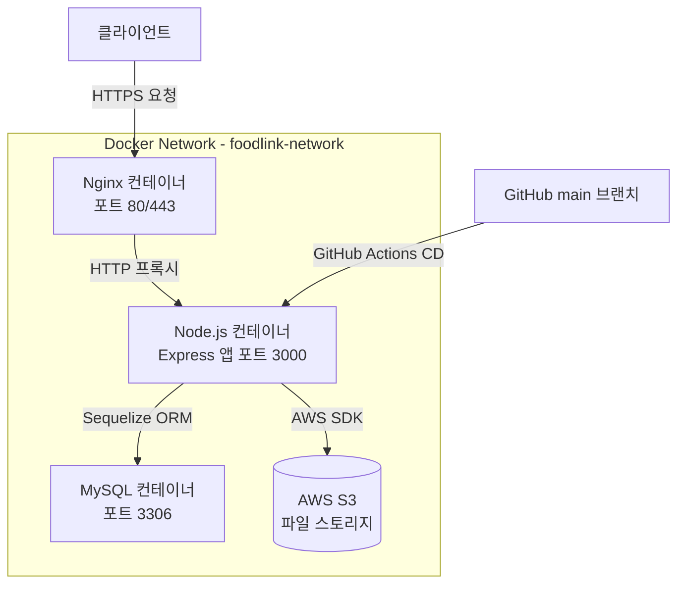

# FoodLink — 백엔드 서버

> GDGoC 팀 프로젝트 **FoodLink**의 백엔드 API 서버입니다.  
> Node.js + Express 기반으로 구축되었으며, MySQL 데이터베이스와 AWS S3 연동, JWT 인증, Swagger 문서화, Docker 컨테이너 배포까지 갖춘 RESTful API 서버입니다.

---

## 프로젝트 소개

FoodLink는 **위치 기반 실시간 마감 할인 음식 공유 플랫폼**입니다. GDGoC Solution Challenge 출품작으로, 3인 팀(백엔드 2명, 프론트엔드 1명)이 함께 개발했습니다.

매년 전 세계에서 막대한 양의 음식물이 낭비되는 한편, 학생·자취생·취약계층은 고물가로 인한 식비 부담을 겪고 있습니다. 소규모 자영업자는 당일 미판매 상품을 폐기하면서 경제적 손실과 폐기 비용이라는 이중고를 안고 있습니다. FoodLink는 이처럼 서로 다른 문제를 가진 두 주체—소상공인과 지역 거주자—를 실시간으로 연결하여 자원 순환 커뮤니티를 형성하는 것을 목표로 합니다.

단순한 할인 앱과 달리, FoodLink는 대형 프랜차이즈가 아닌 **동네 카페·마트·소규모 식당**을 주요 참여 대상으로 삼으며, 금액 할인율 중심이 아닌 **실시간 위치와 유통기한 임박도** 기반의 매칭 시스템을 채택합니다. 나아가 미판매분을 인근 복지기관에 자동 기부 연계하는 확장성을 설계에 포함하고 있어, UN SDGs(빈곤 퇴치, 기아 종식, 기후변화 대응, 책임 있는 소비·생산 등)에 기여하는 사회적 가치를 지향합니다.

본 저장소(`BE`)는 FoodLink의 백엔드 API 서버로, Node.js + Express 기반으로 구현되었으며 AWS EC2 위에서 Docker Compose로 운영됩니다.

---

## 문제 정의

FoodLink는 세 가지 페인 포인트의 교차점에서 출발합니다.

**1. 환경적 위기**
매년 전 세계에서 10억 톤 이상의 음식물이 버려지며 탄소 배출과 환경 파괴로 이어집니다. 음식물 쓰레기는 기후 위기의 주요 원인 중 하나임에도 불구하고, 이를 줄이기 위한 일상적인 접점은 부족한 상황입니다.

**2. 소상공인의 부담**
동네 카페, 개인 마트, 소규모 식당은 당일 팔리지 않은 재고를 폐기하면서 경제적 손실과 쓰레기 처리 비용을 동시에 부담합니다. 기존 마감 할인 앱들은 대형 프랜차이즈 중심으로 운영되어, 소규모 자영업자가 활용할 수 있는 유통 채널이 사실상 없었습니다.

**3. 식비 부담과 정보 비대칭**
학생, 자취생, 식사 취약계층은 고물가 속에서 식비 부담이 가중되고 있습니다. 주변에 저렴하게 구할 수 있는 마감 상품이 존재하더라도, 그 정보가 필요한 사람에게 제때 전달되지 않는 구조적 비대칭이 존재합니다.

FoodLink는 이 세 문제를 **위치 기반 실시간 매칭**으로 동시에 해결하고자 합니다. 버려질 음식을 필요한 사람과 연결함으로써, 소상공인의 손실을 줄이고, 수요자에게는 합리적인 식사 기회를 제공하며, 지역 사회의 자원 순환망을 형성합니다.

---

## 주요 기능

FoodLink는 **매장 점주(store)**와 **일반 사용자(user)** 두 역할을 기준으로 API가 구성됩니다.

**인증 및 계정 관리**
- 매장 점주 회원가입 (`POST /api/store/accounts/signup`) — 매장명, 주소, 위치 좌표(lat/lng), 사업자번호, 인증 이미지 등록 포함
- 일반 사용자 회원가입 (`POST /api/user/accounts/signup`) — 닉네임, 이메일, 비밀번호 입력
- 매장 점주 / 일반 사용자 로그인·로그아웃 (`POST /api/store/accounts/login`, `/api/user/accounts/login`)
- JWT 기반 액세스 토큰 발급 및 `authMiddleware`를 통한 인증 처리

**위치 기반 상품 조회** (일반 사용자)
- 현재 위치(lat/lng) 기준 반경 내 마감 임박 상품 목록 조회 (`GET /api/user/items/nearby?lat=&lng=&radius=`, 기본 반경 500m)
- 특정 매장의 잔여 아이템 목록 조회 (`GET /api/user/items/stores/:storeId`)

**상품 등록 및 관리** (매장 점주)
- 마감 임박 상품 등록 (`POST /api/store/item/add`) — 상품명, 수량, 가격, 유형(`GIVE` 무료 나눔 / `SELL` 할인 판매), 픽업 가능 시간대, 이미지 포함
- 나눔 현황 조회 (`GET /api/store/items/summary`)
- 활성 나눔 물품 목록 조회 (`GET /api/store/items?status=ACTIVE`)
- 나눔 물품 삭제 (`DELETE /api/store/items/:itemId`)

**예약 시스템**
- 일반 사용자: 아이템 예약 수량 선택 (`GET /api/user/reserve/items/:itemId`), 예약하기 (`POST /api/user/reserve/items/:itemId`), 예약 목록 조회 (`GET /api/user/reserve`), 예약 상세 정보 조회 (`GET /api/user/reserve/reservations/:reservationId`)
- 매장 점주: 예약 목록 확인 (`GET /store/reservations?status=CONFIRMED`), 픽업 완료 처리 (`PATCH /api/store/reservations/:reservationId/pickup`), 예약 취소 처리 (`PATCH /api/store/reservations/:reservationId/cancel`)
- 예약 상태는 `CONFIRMED → PICKUP 또는 NOSHOW / CANCEL` 흐름으로 관리

**API 문서화**
- swagger-jsdoc + swagger-ui-express로 라우터 코드 내 JSDoc 주석 기반 OpenAPI 문서 자동 생성
- 매장 점주용 / 일반 사용자용 엔드포인트 분리 구성

---

## 기술 스택

| 분류 | 기술 |
|---|---|
| **언어** | JavaScript (Node.js 20) |
| **프레임워크** | Express v5 |
| **ORM** | Sequelize v6 |
| **데이터베이스** | MySQL 8.0 |
| **인증** | JWT (jsonwebtoken), bcrypt |
| **파일 업로드** | multer, multer-s3, AWS S3 SDK v3 |
| **API 문서화** | swagger-jsdoc, swagger-ui-express |
| **웹서버/프록시** | Nginx (HTTPS, Let's Encrypt) |
| **컨테이너화** | Docker, Docker Compose |
| **CI/CD** | GitHub Actions (CD only) |
| **개발 도구** | nodemon, sequelize-cli |

---

## 아키텍처 및 구조



**다이어그램 근거:**
- `Nginx 컨테이너`: `docker-compose.yml`의 `nginx` 서비스, `nginx/conf.d` 폴더, ports 80/443 및 SSL 인증서 볼륨 마운트 기준
- `Node.js 컨테이너`: `docker-compose.yml`의 `node` 서비스, `Dockerfile`의 `EXPOSE 3000`, `app.js` 엔트리포인트 기준
- `MySQL 컨테이너`: `docker-compose.yml`의 `mysql` 서비스, MySQL 8.0 이미지 기준
- `AWS S3`: `package.json`의 `@aws-sdk/client-s3`, `multer-s3` 의존성 기준
- `GitHub Actions CD`: Actions 탭의 `deploy.yml` 워크플로우, 18회 CD 실행 이력 기준

세 컨테이너(Node, MySQL, Nginx)는 `foodlink-network`라는 단일 Bridge 네트워크 안에서 통신합니다. 외부에서 들어오는 모든 요청은 Nginx가 먼저 받아 SSL 처리 후 Node.js 컨테이너의 3000번 포트로 전달합니다. Node.js 앱은 Sequelize를 통해 MySQL 컨테이너와 통신하며, 파일 업로드가 발생하면 AWS SDK를 사용해 S3에 직접 저장합니다.

MySQL 데이터는 `mysql-data` Named Volume으로 관리되어 컨테이너를 재시작해도 데이터가 보존됩니다. Node.js 앱과 MySQL 모두 `.env` 파일에서 환경 변수를 주입받으며, 민감 정보는 코드에 하드코딩되지 않습니다.

---

## 핵심 구현 포인트

**1. 역할 기반 라우터 분리 구조 (store / user)**
매장 점주와 일반 사용자의 API를 `routes/store`와 `routes/user`로 명확히 분리했습니다. 각 라우터는 기능 단위로 세분화되어 있으며(`productRegisterRouter`, `reservationCancelRouter`, `reservationListRouter` 등), `authMiddleware.js`를 통해 JWT 토큰 검증을 공통으로 처리합니다. 역할에 따른 접근 제어를 라우터 계층에서 명확히 구분한 것이 특징입니다.

**2. 3계층 아키텍처 (Controller — Service — Model)**
요청 처리 흐름을 Controller → Service → Model로 명확히 분리했습니다. `itemController.js`는 요청/응답만 담당하고, 실제 비즈니스 로직은 `itemService.js`에서 처리하며, DB 접근은 Sequelize 모델(`item.js`, `reservation.js` 등)이 담당합니다. 관심사 분리를 통해 각 계층의 역할을 명확히 하고 유지보수성을 높였습니다.

**3. 위치 기반 주변 상품 조회**
`GET /api/user/items/nearby` 엔드포인트는 클라이언트로부터 위도(lat)·경도(lng)·반경(radius, 기본값 500m)을 파라미터로 받아 주변 매장의 마감 임박 상품을 조회합니다. `itemController.js` → `itemService.js`로 이어지는 흐름에서 좌표 기반 필터링 로직이 핵심 구현 포인트입니다.

**4. 예약 상태 머신 설계**
예약 데이터는 `CONFIRMED → PICKUP 또는 NOSHOW / CANCEL`의 상태 흐름으로 관리됩니다. `reservationCancelRouter`, `reservationStatusRouter`가 각 상태 전환을 담당하며, `reserveService.js`에서 상태 변경 비즈니스 로직을 처리합니다.

**5. multer-S3를 활용한 스트리밍 파일 업로드**
`utils/upload.js`에서 multer와 multer-s3를 조합하여 파일 업로드 파이프라인을 구성했습니다. 서버 로컬 디스크를 거치지 않고 S3에 직접 스트리밍 업로드하며, `s3Config.js`에서 AWS 클라이언트 설정을 분리 관리합니다. 매장 인증 이미지(`verifiedImage.js` 모델)와 상품 이미지(`item.js` 모델) 두 종류의 이미지 업로드에 동일한 파이프라인을 재사용합니다.

**6. Docker Compose 기반 멀티 컨테이너 운영 및 GitHub Actions CD**
Node.js, MySQL, Nginx 세 컨테이너를 `foodlink-network`로 묶어 단일 `docker-compose.yml`로 관리합니다. Nginx는 Let's Encrypt SSL 인증서를 볼륨으로 마운트하여 HTTPS 리버스 프록시 역할을 수행합니다. `main` 브랜치에 PR이 머지될 때마다 GitHub Actions `deploy.yml`이 자동 실행되며, 총 18회의 배포 이력이 Actions 탭에서 확인됩니다.

---

## 설치 및 실행 방법

### 사전 요구사항

- Node.js 20 이상
- Docker 및 Docker Compose
- AWS S3 버킷 및 IAM 자격증명
- MySQL (Docker Compose 사용 시 자동 구성)

### 로컬 개발 환경

```bash
# 1. 저장소 클론
git clone https://github.com/FoodLink-GDGoC/BE.git
cd BE

# 2. 의존성 설치
npm install

# 3. 환경 변수 설정 (.env 파일 생성 필요)
cp .env.example .env  # .env.example 존재 여부 확인 필요
# .env 파일에 아래 항목을 직접 작성하세요:
# DB_HOST, DB_PORT, DB_USER, DB_PASSWORD, DB_NAME
# JWT_SECRET
# AWS_ACCESS_KEY_ID, AWS_SECRET_ACCESS_KEY, AWS_REGION, S3_BUCKET_NAME

# 4. 개발 서버 실행 (nodemon 사용)
npm run dev

# 5. 또는 일반 실행
npm start
```

### Docker Compose를 이용한 전체 스택 실행

```bash
# 환경 변수 설정 후
docker compose up -d --build

# 서비스 상태 확인
docker compose ps

# 로그 확인
docker compose logs -f node
```

## 폴더 구조

```
BE/
├── .github/                        # GitHub Actions 워크플로우 및 이슈/PR 템플릿
│   └── workflows/
│       └── deploy.yml              # CD 파이프라인 (main 브랜치 자동 배포)
├── nginx/
│   └── conf.d/                     # Nginx 설정 파일 (리버스 프록시, HTTPS)
├── src/
│   ├── config/
│   │   ├── config.js               # 환경 변수 및 앱 설정
│   │   ├── s3Config.js             # AWS S3 클라이언트 설정
│   │   └── swaggerConfig.js        # Swagger 문서 설정
│   ├── controllers/
│   │   ├── store/
│   │   │   └── storeController.js  # 매장 관련 요청 처리
│   │   └── user/
│   │       ├── itemController.js   # 상품 조회 요청 처리
│   │       ├── reserveController.js# 예약 요청 처리
│   │       └── userController.js   # 유저 인증 요청 처리
│   ├── middlewares/
│   │   └── authMiddleware.js       # JWT 토큰 검증 미들웨어
│   ├── models/
│   │   ├── index.js                # Sequelize 초기화 및 모델 연결
│   │   ├── item.js                 # 상품 모델
│   │   ├── reservation.js          # 예약 모델
│   │   ├── store.js                # 매장 모델
│   │   ├── user.js                 # 유저 모델
│   │   └── verifiedImage.js        # 매장 인증 이미지 모델
│   ├── routes/
│   │   ├── store/
│   │   │   ├── index.js
│   │   │   ├── productRegisterRouter.js    # 상품 등록 라우터
│   │   │   ├── reservationCancelRouter.js  # 예약 취소/노쇼 라우터
│   │   │   ├── reservationListRouter.js    # 예약 목록 라우터
│   │   │   ├── reservationStatusRouter.js  # 예약 상태 변경 라우터
│   │   │   └── storeRoute.js               # 매장 인증 라우터
│   │   ├── user/
│   │   │   ├── index.js
│   │   │   ├── itemRoute.js        # 상품 조회 라우터
│   │   │   ├── reserveRoute.js     # 예약 라우터
│   │   │   └── userRoute.js        # 유저 인증 라우터
│   │   ├── health.js               # 서버 상태 확인 라우터
│   │   └── index.js                # 전체 라우터 진입점
│   ├── services/
│   │   ├── store/
│   │   │   └── storeService.js     # 매장 비즈니스 로직
│   │   └── user/
│   │       ├── itemService.js      # 상품 비즈니스 로직
│   │       ├── reserveService.js   # 예약 비즈니스 로직
│   │       └── userService.js      # 유저 비즈니스 로직
│   └── utils/
│       └── upload.js               # multer-S3 파일 업로드 유틸
├── app.js                          # Express 앱 초기화 및 미들웨어 등록
├── Dockerfile                      # Node.js 20 Alpine 기반 프로덕션 이미지 정의
├── docker-compose.yml              # Node, MySQL, Nginx 멀티 컨테이너 구성
├── package.json                    # 의존성 및 npm 스크립트 정의
└── .gitignore
```

---

## 배운 점

- **Docker Compose 기반 멀티 컨테이너 운영**: 단순히 컨테이너를 띄우는 것을 넘어, 서비스 간 의존성 순서와 네트워크 격리, Named Volume을 활용한 데이터 영속성까지 실무에 가까운 배포 환경을 직접 구성해 보았습니다.

- **GitHub Actions를 통한 CD 자동화**: PR 머지라는 Git 이벤트를 트리거로 서버까지 코드가 자동으로 전달되는 파이프라인을 구성하며, 배포 자동화의 흐름과 이점을 체험했습니다.

- **JWT 인증 플로우 설계**: 토큰 발급, 검증, 비밀번호 해싱 등 인증 시스템의 각 단계를 라이브러리 수준에서 직접 구현하며, 보안 흐름에 대한 이해를 높였습니다.

- **AWS S3 연동을 통한 파일 업로드 아키텍처**: 서버 로컬 디스크 대신 클라우드 스토리지를 활용하는 방식을 적용하면서, 확장성을 고려한 파일 관리 설계를 경험했습니다.

- **Swagger를 활용한 API 문서 협업**: 코드와 문서를 동기화 상태로 유지하는 방식으로, 프론트엔드 팀과 API 스펙을 공유하는 협업 경험을 쌓았습니다.

---

## 향후 개선 사항

- **테스트 코드 작성**: 현재 `package.json`의 test 스크립트가 미구현 상태입니다. 주요 API 엔드포인트에 대한 통합 테스트 또는 단위 테스트 도입이 필요합니다.

- **에러 처리 미들웨어 강화**: `http-errors` 라이브러리가 의존성에 포함되어 있으나, 실제 에러 핸들링 미들웨어 구성의 완성도를 높일 여지가 있습니다.

- **로깅 고도화**: morgan으로 HTTP 요청 로깅은 적용되어 있으나, 애플리케이션 레벨 로깅(winston 등)을 추가해 에러 추적을 강화할 수 있습니다.
